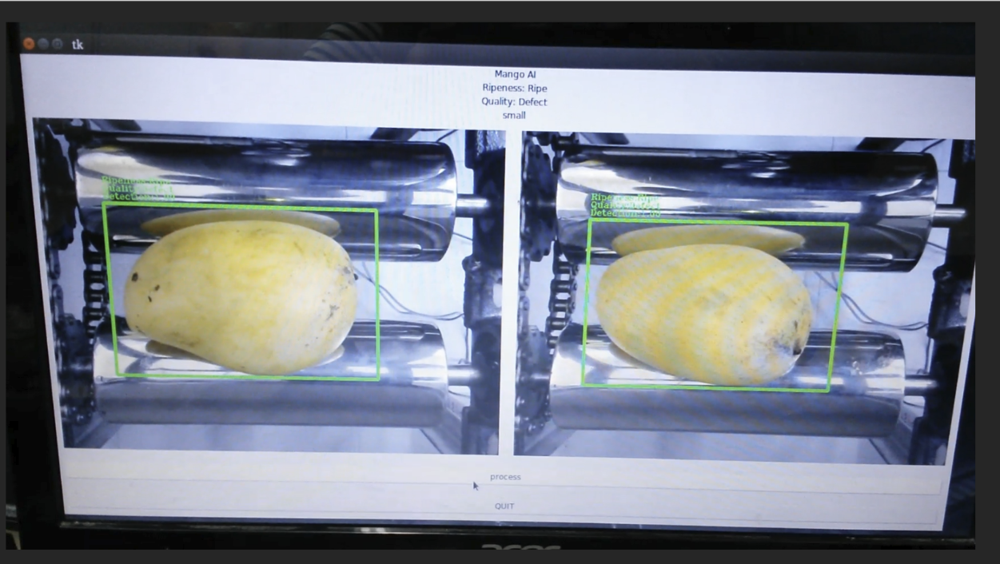
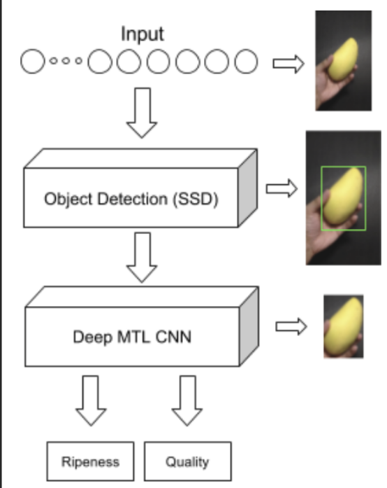
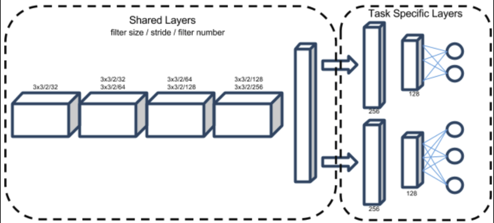
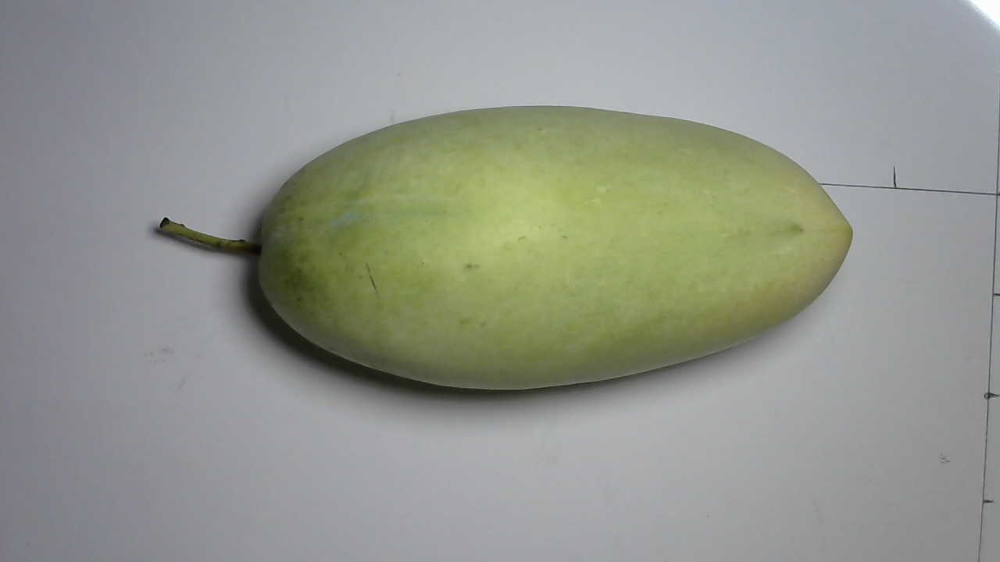
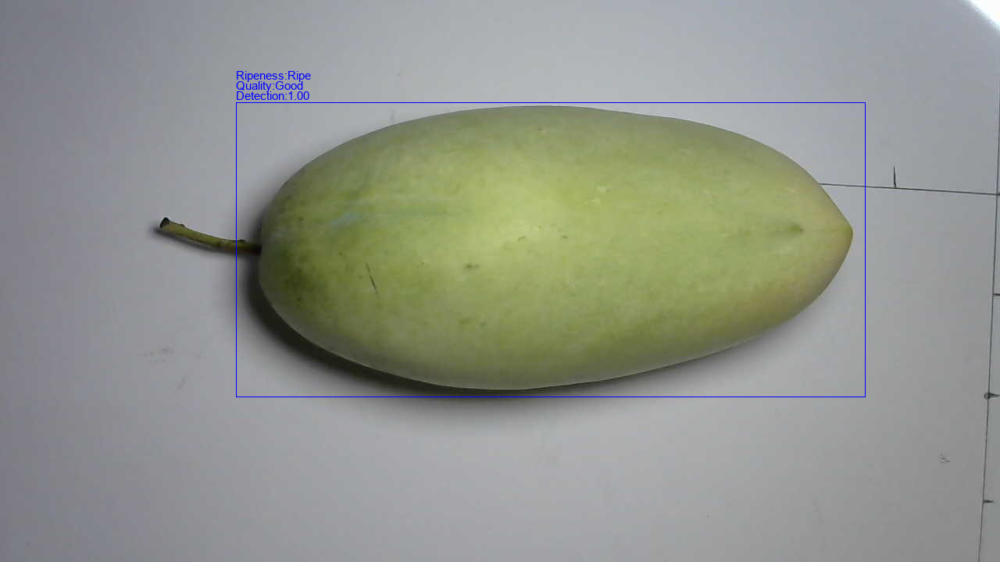

# Deep-MTL-CNN-Mango

My undergraduate thesis, where I attept to classify mangoes by quality, ripeness and Size.
___

## Mango Ripness and Quality Classification 

Sample Demo GIF Links ![1][vid1], ![2][vid1], ![3][vid1], ![4][vid1]!!!

Sample image of GUI. 



### ML Pipeline



### Architecture



### Demo using Docker

This dockerfile I made is for demo purposes.

First Clone the Repository
```
https://github.com/ryanliwag/Deep-MTL-CNN-Mango.git
```

Then Build the Dockerfile (Must Have Docker Installed)
```
sudo docker build -t app .
```
Then pass an image location to the docker run as an argument

```
docker run -v <repository path on host>:/app:rw --rm app -i <image path within the local work directory> -m1 frozen_models/MTL_frozen_model.pb -m2 frozen_models/frozen_inference_graph.pb
```

**Example Usage** 

Using one of the test images, inside this repository (gifs_images/test_1.jpeg)



Run on the Command Line
```
docker run -v /home/elements/Desktop/github-shit/Deep-MTL-CNN-Mango:/app:rw --rm app -i gifs_images/test_2.jpeg -m1 frozen_models/MTL_frozen_model.pb -m2 frozen_models/frozen_inference_graph.pb
```

It will save the output as tmp.png in the directory path




[vid1]: https://github.com/ryanliwag/Deep-MTL-CNN-Mango/tree/master/gifs_images/video_1.gif "Video 1"
[vid2]: https://github.com/ryanliwag/Deep-MTL-CNN-Mango/tree/master/gifs_images/video_2.gif "Video 2"
[vid3]: https://github.com/ryanliwag/Deep-MTL-CNN-Mango/tree/master/gifs_images/video_3.gif "Video 3"
[vid4]: https://github.com/ryanliwag/Deep-MTL-CNN-Mango/tree/master/gifs_images/video_4.gif "Video 4"
